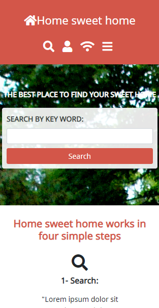
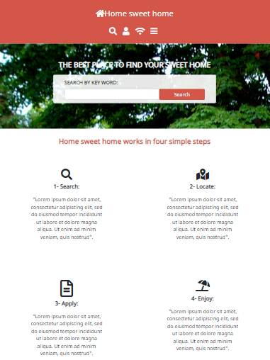
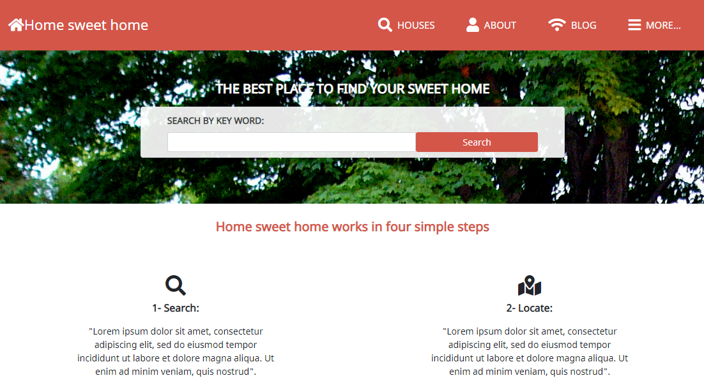

# 8 Capstone Project

> The project I'm going to build for the HTML & CSS Capstone Project is based on an online directory of schools. I just follow the given design of the website, but I personalise the content, instead of a directory of schools I built a real state agency web site.

## Built With

- HTML 5
- CSS 3
- Bootstrap
- Sass

## Live Demo

[Live Demo Link](https://raw.githack.com/vichuge/8-capstone-project/feature/index.html)

## Getting Started

- Clone or download this project on your computer
- Open it with your favorite browser

## Author

👤 **Victor Pacheco**

- GitHub: [@vichuge](https://github.com/vichuge)
- LinkedIn: [LinkedIn](https://www.linkedin.com/in/victor-pacheco-7946aab2/)

## 🤝 Contributing

Contributions, issues, and feature requests are welcome.

Feel free to check the [issues page](https://github.com/vichuge/8-capstone-project/issues).

## Show your support

Give a ⭐️ if you like this project!

## 📝 License

This project is [Creative Commons Legal Code](https://github.com/vichuge/8-capstone-project/blob/main/LICENSE) licensed.
Artistic attribution for [Mathew Njuguna](https://www.behance.net/mathewnjuguna) and [Sam Achola](https://www.behance.net/aweSam)
